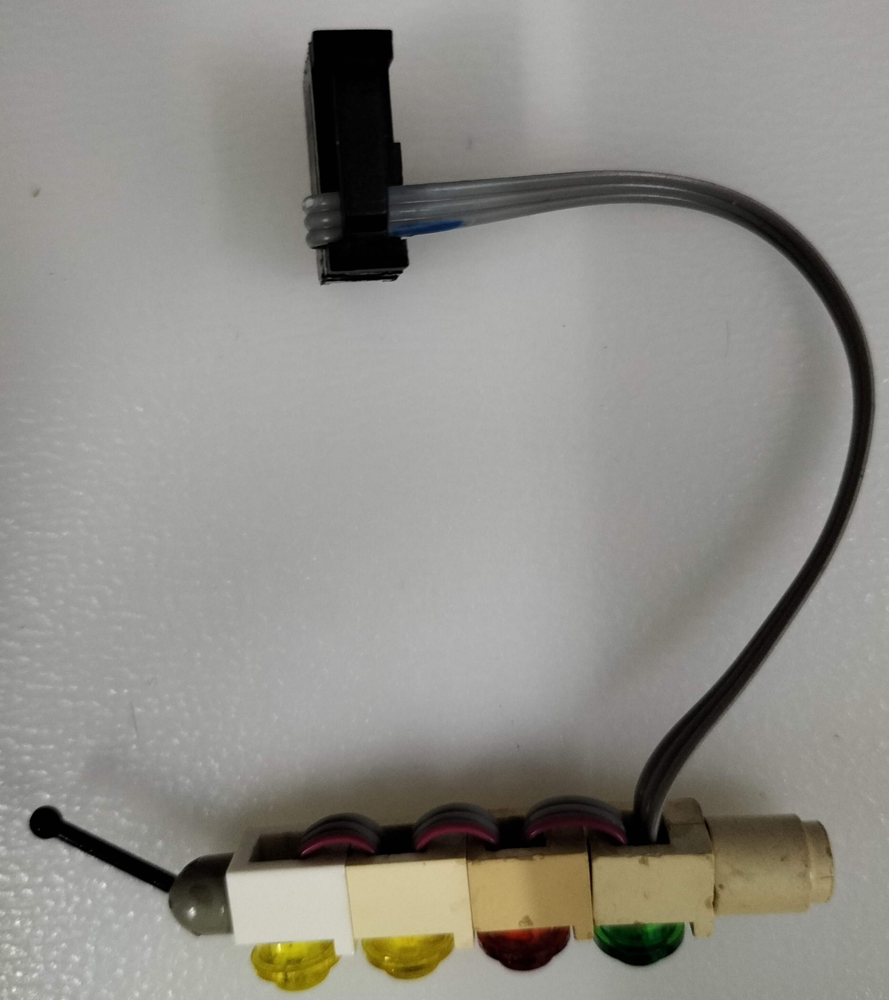

# Start Light modification for Lego 6551 (1992) with WS2812 LEDs and ESP01 module.

32 years ago, got this [set](https://brickset.com/sets/6551-1/Checkered-Flag-500) as a birthday present. Had a great fun playing with it too. But wait... why not add some LEDs to brighten up the set?

The start light is a good start (no pun intended) - attempted to put 4 ultra-bright LEDs, and many tiny cables shoved into the headlight bricks isn't a fun idea and it ends up being *very* messy. Since there are 4 LEDs, 8 strands of wire-wrap wires are used and it clutters up the place. Some UHU glue was applied to hold the LEDs inside the bricks and about a few years later these bricks are slightly disfigured possibly due to the plastic dissolving into the glue.

The other alternative is to use a WS2812 strip to reduce the number of cables to 3. Regular size WS2812 strips are too big for the headlight bricks, therefore a smaller strip must be used, as shown in the pic:

You can get these from AliExpress or similar stores.

Since we only need 4 of them, snip 4 of them and make sure you have snip them from the middle part in between the both LEDs so that you can solder them comfortably. Also, you may need to connect **each** of these (**recommended 1cm**) using a 1mm pitch ribbon cable.

After soldering and joining these LEDs, gently use a small tweezer and place the LED into each of the headlight until the LED snugly fits that hole. Be careful not to bend the wires too often!

It should look like this if you have placed the LEDs correctly:

You can use a short IDC connector at the other end of the cable to easily plug into the board too:

## What you need:
- Lego 6551 (of course!)
- ESP-01 module.
- [ESP-01 programmer module](https://my.cytron.io/p-esp01-usb-programmer-adapter).
- [Narrow 3.5mm WS2812 strip](https://www.aliexpress.us/item/2255800558241158.html?gatewayAdapt=glo2usa4itemAdapt). 
- Prototyping board (5x7 one, you can cut it as small as possible)
- Connector that can accomodates 3 pins and some headers. Here I'm using the IDC but you can improvise it.
- Ribbon cable (1mm pitch)
- Push button switch.
- Some wires.
- 10K resistor.

## Schematic:

## Start Light Board with ESP01:

- At the left beside the button it is the power connector.
- At the right beside the ESP01 is the connector for the start light. The IDC connector can be plugged into it for convenience.

## How it works:
It's quite simple - the Adafruit Neopixel driver does most of the job. Each LED light up for 1 second (yellow -> yellow -> red -> green) and then goes into deep sleep. Just press the Reset button to do this again.

## Demo:

